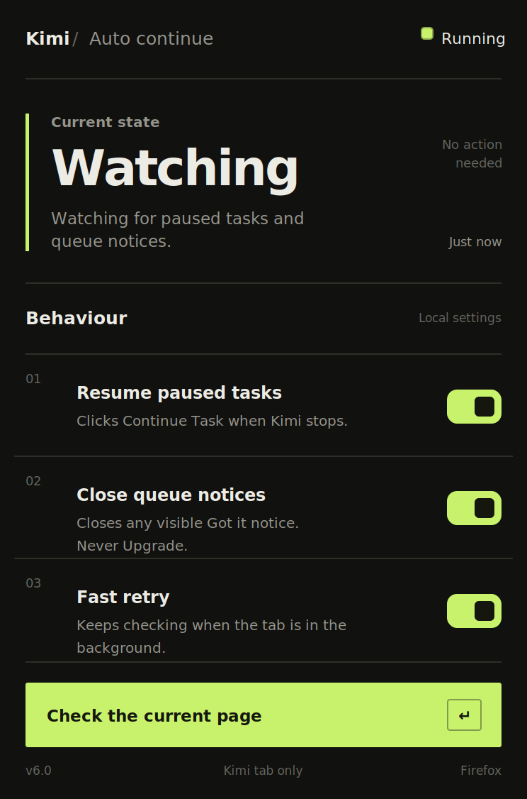

<h1 align="center">Raikkonen</h1>

<p align="center">
  A small Firefox extension that keeps Kimi moving when the queue tells it to take a pit stop.
</p>

<p align="center">
  
</p>

## What it does

Raikkonen watches open Kimi tabs and handles the repetitive controls that can appear during periods of high demand:

- clicks **Continue Task** when a task is paused
- closes visible **Got it** queue notices
- never clicks **Upgrade**
- keeps watching while the Kimi tab is in the background
- provides a manual page check and simple local settings

It does not bypass Kimi's queue, subscription system, authentication, or server-side usage limits. It only performs the same page interactions you could perform yourself, with considerably less finger mileage.

## Why “Raikkonen”?

It is named after Kimi Räikkönen, the Formula One driver. One Kimi was famous for being fast and not saying much. This one sometimes needs encouragement to continue.

This project is unofficial and is not affiliated with Kimi, Moonshot AI, Kimi Räikkönen, Formula One, or any racing team.

## Install in Firefox

1. Open the repository's **Releases** page.
2. Download `kimi-auto-continue-firefox-v6.0.1.zip` from the latest release.
3. Extract the ZIP.
4. Open `about:debugging` in Firefox.
5. Select **This Firefox**.
6. Click **Load Temporary Add-on…**.
7. Select `manifest.json` from the extracted folder.
8. Reload every open Kimi tab with <kbd>Ctrl</kbd> + <kbd>R</kbd>.

> Firefox removes temporary add-ons after the browser restarts. A permanently installable build must be signed by Mozilla.

## Usage

Open the extension popup to configure:

| Setting | Behaviour |
| --- | --- |
| **Resume paused tasks** | Clicks `Continue Task` when it appears. |
| **Close queue notices** | Clicks a visible `Got it` control and never selects `Upgrade`. |
| **Fast retry** | Checks more frequently, including while the tab is in the background. |
| **Check the current page** | Runs an immediate scan of the active Kimi tab. |

Keep Firefox and the Kimi tab open. Background operation stops if the computer sleeps, Firefox closes, or Firefox unloads the tab to save memory.

## How it works

The content script runs only on Kimi and Moonshot domains declared in `manifest.json`. It combines:

- `MutationObserver` for immediate reactions to page changes
- fallback polling for background tabs
- nested element and open shadow-root scanning
- native click, pointer, mouse, and keyboard activation fallbacks
- click cooldowns to avoid repeatedly hammering the same control

Settings and diagnostics are stored locally through Firefox extension storage. The extension does not transmit analytics or collect personal data.

## Project structure

```text
.
├── assets/
│   └── preview.svg   # extension interface preview
├── content.js        # detection and automatic clicking
├── popup.html        # extension popup markup
├── popup.css         # popup styling
├── popup.js          # popup settings and diagnostics
├── manifest.json     # Firefox extension manifest
└── icon.svg          # scalable Firefox toolbar icon
```

## Development

There is no framework, package manager, build process, or backend. Edit the files directly, reload the temporary add-on from `about:debugging`, and refresh the Kimi tab.

## License

MIT. See [LICENSE](LICENSE).
